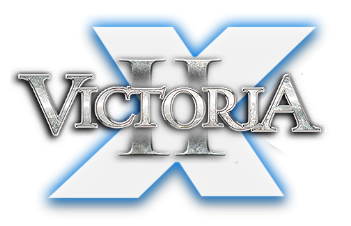

# Victoria 2: X
Mod for Victoria 2 set in the X Universe.

Note: this is still very early in active development. There are many missing features, balancing issues, and lack of flavour. Please visit the [Victoria 2 Modding Discord](https://discord.gg/VFu3GjEjxM) in channel `#x-general` to discuss the mod, suggest improvements, or report bugs.

## Installation Instructions
### Git
1. Go to your Victoria 2 mod folder. If you use Steam on Windows, the folder is mostly likely `C:\Program Files (x86)\Steam\steamapps\commmon\Victoria 2\mod`.
2. Run `git clone https://github.com/s-williams/Victoria-2-X.git`
3. Rename the newly created folder from "Victoria-2-X" to "X"
4. From the "X" folder, move X.mod one level up so that it is in the mod folder, alongside the "X" folder.
5. Launch the game. You should see X as one of the mod options in the launcher. Tick it and the mod should load.

### Download
1. Go to your Victoria 2 mod folder. If you use Steam on Windows, the folder is mostly likely `C:\Program Files (x86)\Steam\steamapps\commmon\Victoria 2\mod`.
2. Download the mod by clicking [here](https://github.com/s-williams/Victoria-2-X/archive/refs/heads/master.zip) or click the the green Code button, then Download ZIP. Extract the folder to your Victoria 2 mod folder.
3. Rename the extracted folder from "Victoria-2-X-master" to "X".
4. From the "X" folder, move X.mod one level up so that it is in the mod folder, alongside the "X" folder.
5. Launch the game. You should see X as one of the mod options in the launcher. Tick it and the mod should load.

## Credits
Full credits can be found at [CREDITS.md](/CREDITS.md).
